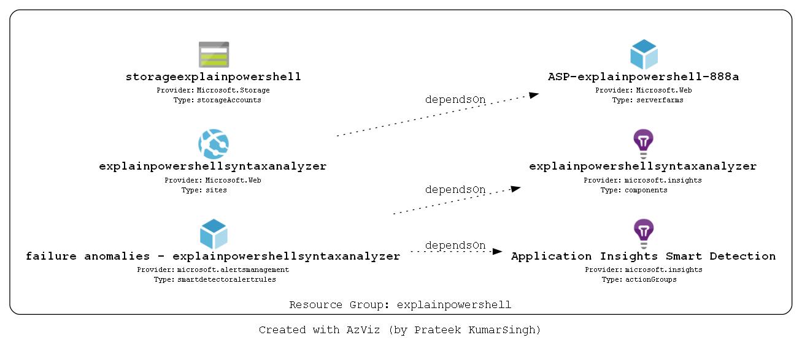

# Explain PowerShell

PowerShell version of [explainshell.com](explainshell.com)

On ExplainShell.com, you can enter a Linux terminal oneliner, and the site will analyze it, and return snippets from the proper man-pages, in an effort to explain the oneliner. 
I would like to create the same thing but for PowerShell. 

I have a proof of concept running [here](https://storageexplainpowershell.z6.web.core.windows.net/).

## Goal
I envision something like this:

## Azure Resources overview

* C# Azure Function backend API that analyzes PowerShell oneliners.
* Azure Storage that hosts Blazor Wasm pages as a static website.
* Azure Storage Table in which all help metadata is for currently supported modules.

