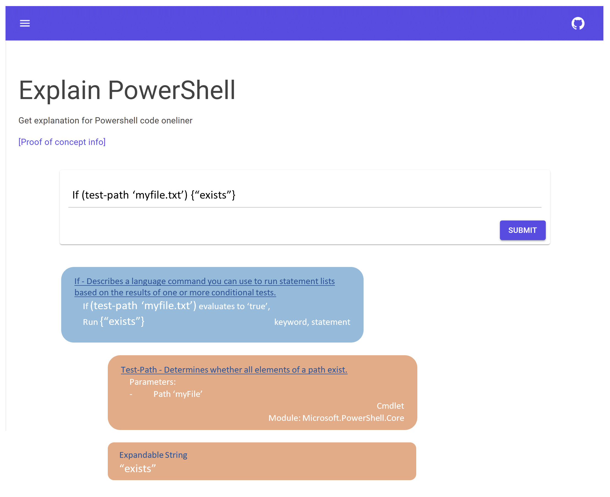
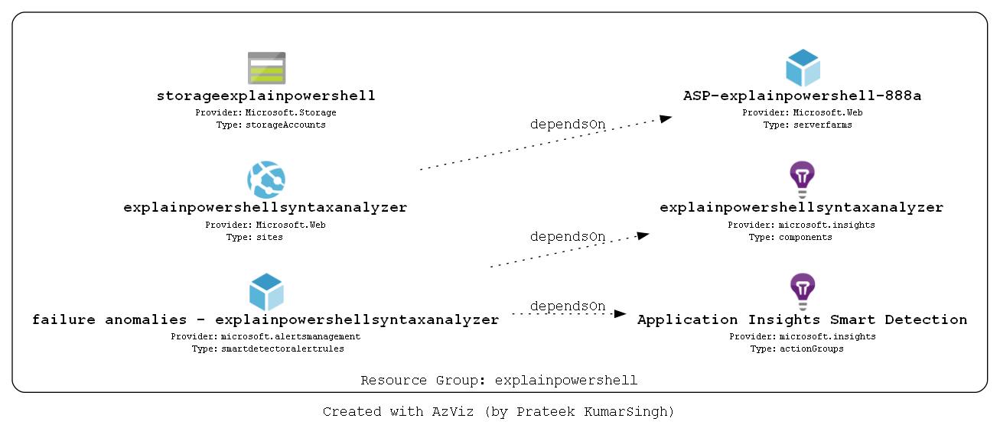

# Explain PowerShell

PowerShell version of [explainshell.com](explainshell.com)

On ExplainShell.com, you can enter a Linux terminal oneliner, and the site will analyze it, and return snippets from the proper man-pages, in an effort to explain the oneliner. 
I have created a similar thing but for PowerShell here:

https://www.explainpowershell.com

If you'd like a tour of this repo, open the repo in VSCode (from here with the '.' key), and install the [CodeTour](vsls-contrib.codetour) extension. In the Explorer View, you will now see CodeTour all the way at the bottom left. There currently are four code tours available:
- High level tour of the application
- Tour of development container
- Tour of the Azure bootstrapper
- Tour of the help collector

## Goal

I want to make it easy for anyone to find out what a certain line of PowerShell code does.
I envision something like this:



## Azure Resources overview

* C# Azure Function backend API that analyzes PowerShell oneliners.
* Azure Storage that hosts Blazor Wasm pages as a static website.
* Azure Storage Table in which all help metadata is for currently supported modules.



## Development

The repo now runs directly on your host machine; no devcontainers are required. A typical setup looks like this:

1. Install prerequisites: the latest .NET SDK (currently 10.x), Azure Functions Core Tools v4, PowerShell 7.4+, and the VS Code extensions recommended in `.vscode/extensions.json` (notably the Azurite extension `azurite.azurite`).
2. Clone the repository and open it in VS Code. Run `./bootstrap.ps1` from the repo root once to install PowerShell modules, restore dependencies, seed the Azurite table storage, and run the backend tests. The Azure Function backend now runs as a .NET 10 isolated worker, so make sure the `FUNCTIONS_WORKER_RUNTIME` remains `dotnet-isolated` in `local.settings.json`.
3. Start the Azurite Table service via the VS Code Azurite extension (`Az: Start Table Service` from the Command Palette). The tests expect the table endpoint to be available on `http://127.0.0.1:10002`.
4. Use the provided launch configurations and `Watch run ...` tasks to iterate quickly; they continue to rely on `dotnet watch` under the hood.

### Access to local emulated db

With the Azurite extension running, the local table endpoint is still `http://localhost:10002/devstoreaccount1/HelpData`. Connect with [Azure Storage Explorer](https://azure.microsoft.com/en-us/features/storage-explorer/) using the default development keys if you want to inspect the generated metadata.

## Deploying to Azure

Deploying to Azure is done using GitHub Actions. To set everything up, you will need to create an Azure resource group, an service principal for that group. Also you will need to save the secret for that service principal in GitHub as a secret. Lastly you need to give your resources a name. 
I wrote a script so you can sit back and relax while all that is being done for you. Just make sure you log on to GitHub an Azure when prompted.

```powershell
./azuredeploymentbootstrapper.ps1 -SubscriptionId 12345678-91e7-42d9-bb2d-09876543321 -ResourceGroupName MyExplainPowerShell -AzureLocation westeurope
```

After this, go to your explainpowershell fork on GitHub. Under Actions, run the `Deploy Azure Infra` workflow, then the `Deploy app to Azure` workflow and run `./explainpowershell.helpwriter.ps1 -Force -IsProduction -ResourceGroupName $ResourceGroupName -StorageAccountName $StorageAccountName`.
The Url where you can reach your version of the project can be found in the Azure Portal. Under the storage account resource that was deployed, find the `Static Website` entry in the menu. It is the Url for `Primary Endpoint`. 
Alternatively, you can retrieve it with `az`:

```powershell
$myStorageAccountName = ".."
(az storage account show --name $myStorageAccountName | convertfrom-json).primaryEndpoints.web
```
