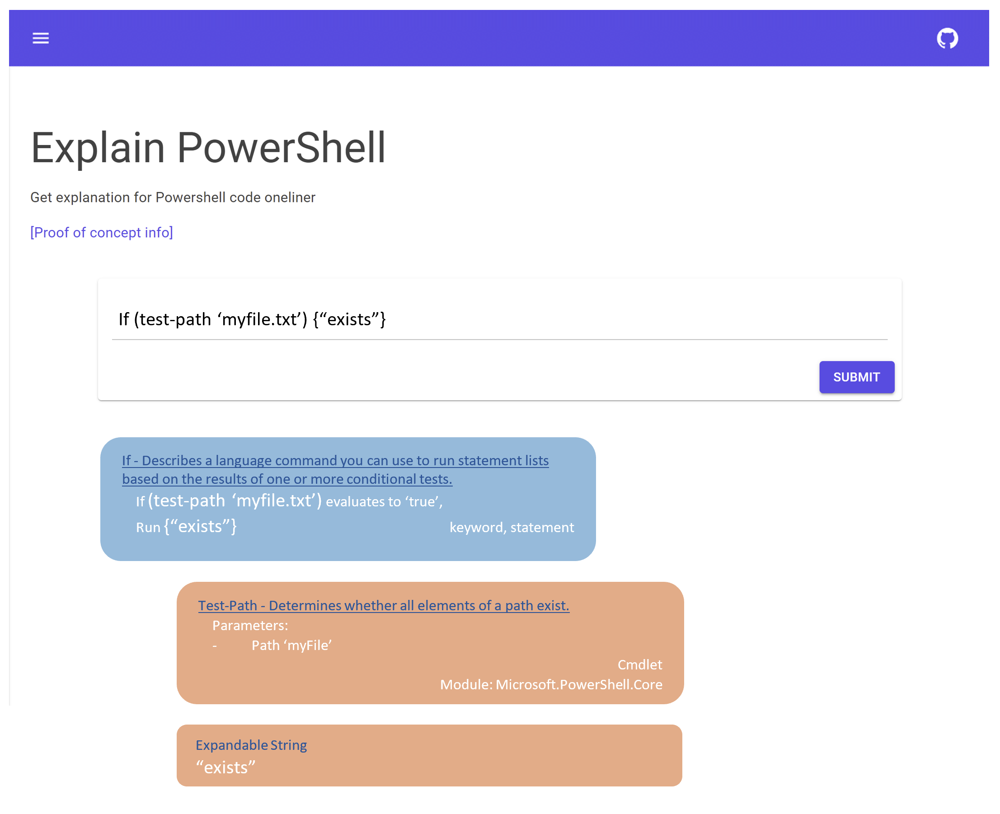
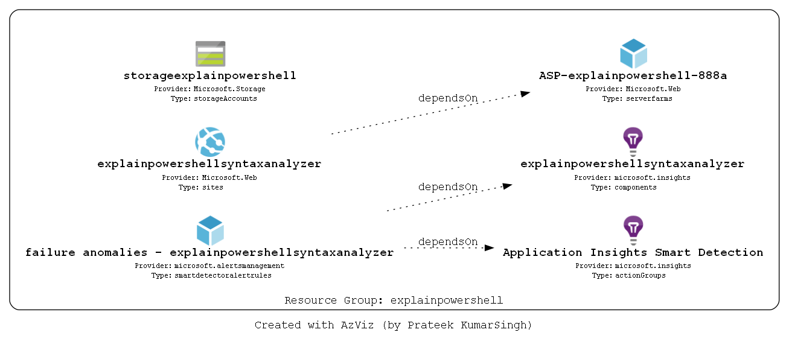

# Explain PowerShell

PowerShell version of [explainshell.com](explainshell.com)

On ExplainShell.com, you can enter a Linux terminal oneliner, and the site will analyze it, and return snippets from the proper man-pages, in an effort to explain the oneliner. 
I have created a similar thing but for PowerShell here:

https://www.explainpowershell.com

If you'd like a tour of this repo, open the repo in VSCode (from here with the '.' key), and install the [CodeTour](vsls-contrib.codetour) extension. In the Explorer View, you will now see CodeTour all the way at the bottom left. There currently are four code tours available:
- High level tour of the application
- Tour of development container
- Tour of the Azure bootstrapper
- Tour of the help collector

## Goal

I want to make it easy for anyone to find out what a certain line of PowerShell code does.
I envision something like this:



## Azure Resources overview

* C# Azure Function backend API that analyzes PowerShell oneliners.
* Azure Storage that hosts Blazor Wasm pages as a static website.
* Azure Storage Table in which all help metadata is for currently supported modules.



## Development
This repository provides a simple setup script to get your development environment ready.

### Prerequisites
- Windows 10/11
- Windows Package Manager (winget) - comes pre-installed on recent Windows versions
- PowerShell 7 or later

### Setup
1. Clone the repository
2. Open PowerShell as Administrator
3. Run the setup script:
```powershell
.\setup.ps1
```

The script will install all necessary dependencies:
- .NET SDK
- PowerShell 7
- Azure CLI
- Git
- Node.js and Azurite (for local storage emulation)
- Visual Studio Code with recommended extensions

### Starting the Development Environment
1. Start Azurite from VS Code:
   - Open Command Palette (Ctrl+Shift+P)
   - Type and select 'Azurite: Start'
2. Open the solution in Visual Studio Code
3. Use the pre-configured launch configurations and tasks. Use the `Watch run ..` tasks if you want to iterate quickly without debugging (these use dotnet watch under the hood).

### Access to Local Emulated DB
The local emulated db runs through the Azurite VS Code extension. It's accessible through `http://localhost:10002/devstoreaccount1/HelpData` using [Azure Storage Explorer](https://azure.microsoft.com/en-us/features/storage-explorer/) with the default development keys. See [Azurite documentation](https://docs.microsoft.com/en-us/azure/storage/common/storage-use-azurite) for more info.

## Deploying to Azure

Deploying to Azure is done using GitHub Actions. To set everything up, you will need to create an Azure resource group, an service principal for that group. Also you will need to save the secret for that service principal in GitHub as a secret. Lastly you need to give your resources a name. 
I wrote a script so you can sit back and relax while all that is being done for you. Just make sure you log on to GitHub an Azure when prompted.

```powershell
./azuredeploymentbootstrapper.ps1 -SubscriptionId 12345678-91e7-42d9-bb2d-09876543321 -ResourceGroupName MyExplainPowerShell -AzureLocation westeurope
```

After this, go to your explainpowershell fork on GitHub. Under Actions, run the `Deploy Azure Infra` workflow, then the `Deploy app to Azure` workflow and run `./explainpowershell.helpwriter.ps1 -Force -IsProduction -ResourceGroupName $ResourceGroupName -StorageAccountName $StorageAccountName`.
The Url where you can reach your version of the project can be found in the Azure Portal. Under the storage account resource that was deployed, find the `Static Website` entry in the menu. It is the Url for `Primary Endpoint`. 
Alternatively, you can retrieve it with `az`:

```powershell
$myStorageAccountName = ".."
(az storage account show --name $myStorageAccountName | convertfrom-json).primaryEndpoints.web
